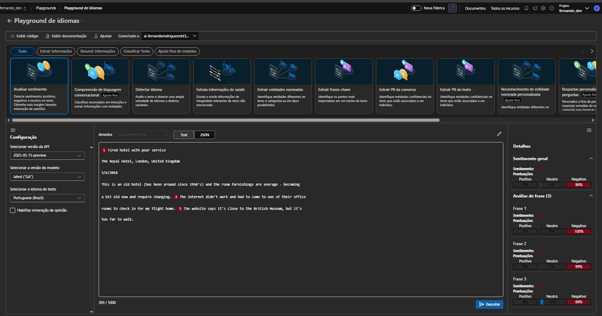

# Desafio de Projeto: [Nome do Desafio Aqui]

## Descrição
Este repositório contém a entrega do desafio de projeto sobre criação de recursos e analise de sentimentos.
## O que foi feito
Durante o projeto, realizei as seguintes etapas:
- Passo 1: Criação da conta na Azure
- Passo 2: Criei um novo projeto
- Passo 3: Testes de análise de sentimentos

## Aprendizados
Aprendi a utilizar uma das ferramentas de análise de sentimentos para saber o perfil do usuário. 
## Evidências (Imagens)
Abaixo está a captura de tela solicitada no desafio:

